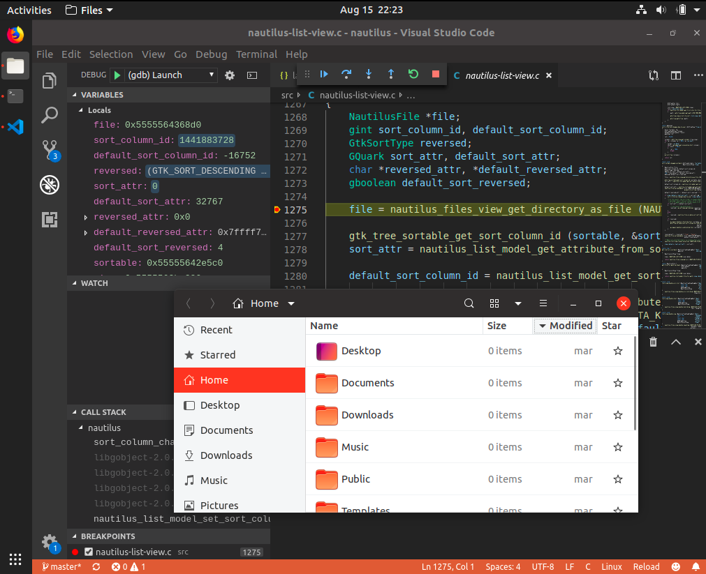

# gnome development

This page shows how to setup a linux dev env to contribute in gnome development using vscode as IDE.
As an example nautilus repository will be considered.

- install [code](https://code.visualstudio.com/)

- install code extensions

```sh
code --install-extension ms-vscode.cpptools
code --install-extension austin.code-gnu-global
code --install-extension mitaki28.vscode-clang
code --install-extension asabil.meson
code --install-extension natqe.reload
```

- install base development tools
```sh
sudo apt-get install -y git build-essential clang cmake pkg-config
```

- install meson and ninja
```sh
pip3 install --user meson
```

- add `~/.local/bin` to PATH ( eg. `echo ~/.local/bin >> ~/.bashrc` for python modules load )

- install dependencies
```sh
sudo apt-get install -y \    
  libgtk-3-dev libgexiv2-dev libgstreamer-plugins-base1.0-dev libgnome-autoar-0-dev \
  libgnome-desktop-3-dev libtracker-sparql-2.0-dev libxml2-dev appstream-util \
  gobject-introspection libgirepository1.0-dev
```

- clone source repo
```sh
~$`git clone https://gitlab.gnome.org/GNOME/nautilus.git`
```

- build it
```sh
~$ cd nautilus
meson build
cd build
ninja
```

- debug it
```sh
~/nautilus/build$ code ..
```

- answer yes to the question that appears at start `Meason project detected, would you like VS Code to configure it?'

- set some breakpoint on the code using F9 ( can search symbols through CTRL+T )

- hit F5 and choose environment `C++ (GDB/LLDB)` this will open first time `launch.json` and set followings

```json
"program": "${workspaceFolder}/build/src/nautilus",
```



- to automate build on debug set a `tasks.json` file and set a prelaunchTask in the `launch.json`, following complete files

- `~/nautilus/.vscode/launch.json`
```json
{
    "version": "0.2.0",
    "configurations": [
        {
            "name": "(gdb) Launch",
            "type": "cppdbg",
            "request": "launch",
            "program": "${workspaceFolder}/build/src/nautilus",
            "args": [],
            "stopAtEntry": false,
            "preLaunchTask": "build",
            "cwd": "${workspaceFolder}",
            "environment": [],
            "externalConsole": false,
            "MIMode": "gdb",
            "setupCommands": [
                {
                    "description": "Enable pretty-printing for gdb",
                    "text": "-enable-pretty-printing",
                    "ignoreFailures": true
                }
            ]
        }
    ]
}
```

- `~/nautilus/.vscode/tasks.json`
```json
{
    "version": "2.0.0",
    "tasks": [
        {
            "label": "prebuild",
            "command": "meson",
            "type": "process",
            "args": [
                "build"
            ],
            "options": {
                "cwd": "${workspaceRoot}"
            },
            "problemMatcher": "$msCompile"
        },
        {
            "label": "build",
            "command": "ninja",
            "dependsOn": "prebuild",
            "type": "process",
            "args": [               
            ],
            "options": {
                "cwd": "${workspaceRoot}/build"
            },
            "problemMatcher": "$msCompile"
        }
    ]
}
```
