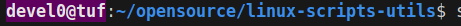

# prompt colors

- clone [linux-script-utils](https://github.com/devel0/linux-scripts-utils)

```sh
source linux-scripts-utils/themeprompt
```

- usage

```
themeprompt [prod|prod-user|dev|dev-user|test|test-user]
```

or custom

```
themeprompt [fg] [bg]
```

| cmd                     | sample                                      |
| ----------------------- | ------------------------------------------- |
| `themeprompt prod`      |          |
| `themeprompt prod-user` |     |
| `themeprompt dev`       |           |
| `themeprompt dev-user`  |      |
| `themeprompt test`      |          |
| `themeprompt test-user` |     |
| `themeprompt 15 53`     |  |
| `themeprompt 53`        |     |

- full color table follows


