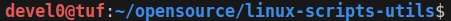
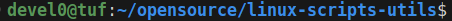

# prompt colors

| cmd                     | sample                                   |
| ----------------------- | ---------------------------------------- |
| `themeprompt prod`      |       |
| `themeprompt prod-user` |  |
| `themeprompt dev`       |        |
| `themeprompt dev-user`  |   |
| `themeprompt test`      |       |
| `themeprompt test-user` |  |

