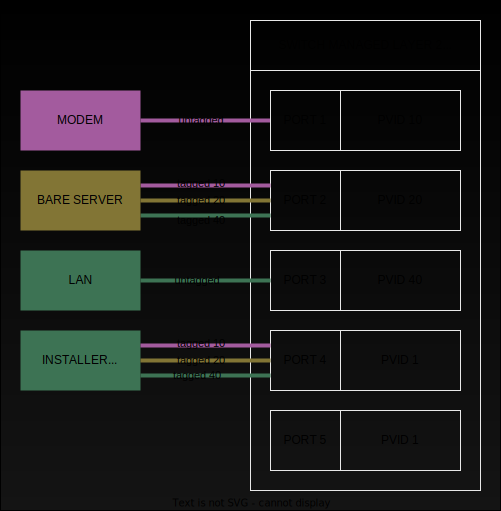

# quick and dirty virtualized vlan server install

- [VLAN scenario](#vlan-scenario)
- [General network and address inventory](#general-network-and-address-inventory)
- [Keywords to replace](#keywords-to-replace)
- [General server setup](#general-server-setup)
- [Setup workstation to connect vms](#setup-workstation-to-connect-vms)
- [Bare metal](#bare-metal)
- [Firewall/VPN install](#firewallvpn-install)
- [Dns/Dhcp server](#dnsdhcp-server)
- [Setup workstation after basic vms install](#setup-workstation-after-basic-vms-install)
- [Nginx server](#nginx-server)
- [Modem DMZ](#modem-dmz)
- [general docker install](#general-docker-install)

## VLAN scenario



- hardware: 5 port managed switch layer2 ( TL-SG605E )

| Port | PVID | Purpose         |
| ---- | ---- | --------------- |
| 1    | 10   | Modem           |
| 2    | 20   | Server          |
| 3    | 40   | Lan             |
| 4    | 1    | Installer admin |
| 5    | 1    |                 |

| VLAN ID | VLAN Name | Member Ports | Tagged Ports | Untagged Ports |
| ------- | --------- | ------------ | ------------ | -------------- |
| 1       | Default   | 5            |              | 5              |
| 10      | Modem     | 1,2,4        | 2,4          | 1              |
| 20      | Bare      | 2,4          | 2,4          |                |
| 40      | Lan       | 2,3,4        | 2,4          | 3              |

- Modem traffic ( that's untagged ) enters switch on port1 becoming tagged VLAN10 ( because of PVID )
- Lan traffic ( that's untagged ) enters switch on port3 becoming tagged VLAN40 ( because of PVID )
- Modem can't reach directly the Lan because modem VLAN10 isn't member of port 3
- Lan can't reach directly the Modem because lan VLAN40 isn't member of port 1
- Bare metal server has the ethernet splitted into 3 vlan devices with VLAN10, VLAN20, VLAN40 thus it can receive frames from Modem/Lan
- Tagged frames VLAN10 by the server are allowed to reach only PORT1 ( modem )
- Tagged frames VLAN40 by the server are allowed to reach only PORT3 ( lan )
- he way which the LAN reach internet is through the gateway VLAN40 of the server firewall
- the way which the INTERNET reach servers or lan is controlled by the firewall through iptables VLAN interfaces matching
- Port4 is used during the installer phase and accepts only tagged frames for VLAN10,VLAN20,VLAN40 allowing that workstation within vlan configured intefaces to deal with modem, server and lan. (after install, this cable will normally detached and not used)

## General network and address inventory

| network      | tag           | ips                     |
| ------------ | ------------- | ----------------------- |
| 10.10.0.0/24 | vlan10        | 10.10.0.1 (firewall)    |
|              |               | 10.10.0.254 (modem)     |
| 10.10.1.0/24 | vlan20        | 10.10.1.1 (firewall)    |
|              |               | 10.10.1.10 (main-bare)  |
|              |               | 10.10.1.30 (main-nginx) |
|              |               | 10.10.1.254 (switch)    |
| 10.10.4.0/24 | vlan40        | 10.10.4.1 (firewall)    |
|              |               | 10.10.4.11 (dns/dhcp)   |
|              |               | 10.10.4.254 (wifi)      |
| 10.10.5.0/24 | vpn wireguard | 10.10.5.1 (wg)          |

## Keywords to replace

| keyword          | description                   |
| ---------------- | ----------------------------- |
| searchathing.com | replace with your domain name |

## General server setup

Following steps can applied to bare metal server and other vm server

- distro: [ubuntu server 22.04.4 LTS](https://ubuntu.com/download/server)

- vm memory : shared

- install using LVM

- expand volume

```sh
lvextend -l +100%FREE /dev/ubuntu-vg/ubuntu-lv 
resize2fs /dev/mapper/ubuntu--vg-ubuntu--lv 
```

- create `~/.nanorc`

```
bind ^Z suspend main
```

- make changes to `~/.bashrc`

```sh
HISTSIZE=1000000
HISTFILESIZE=2000000
force_color_prompt=yes

# replace 32m with 41m
PS1='${debian_chroot:+($debian_chroot)}\[\033[01;41m\]\u@\h\[\033[00m\]:\[\033[01;34m\]\w\[\033[00m\]\$ '

alias mv='mv -i'
alias cp='cp -i'
alias rm='rm -i'
```

- uncomment bash completion

```sh
if [ -f /etc/bash_completion ] && ! shopt -oq posix; then
    . /etc/bash_completion
fi
```

- apply `~/.ssh/authorized_keys` then disable ssh password mode setting `/etc/ssh/sshd_config.d/50-cloud-init.conf` to

```
PasswordAuthentication no
```

- after configured `~/.ssh/config` in the workstation with the settings for server connect ( need to create rsa key in workstation and export public part to authorized_keys of the server ) you can connect remotely to the server using `vscode` C-s-p `Remote-SSH: Connect to Host...`

## Setup workstation to connect vms

Follow the procedure to setup the workstation to be able create essential server vms

- Install a desktop distribution [kubuntu](https://cdimage.ubuntu.com/kubuntu/releases/24.04/release/kubuntu-24.04-desktop-amd64.iso)

- Install qemu-kvm virt-manager

```sh
apt install virt-manager
```

- Setup vlan to allow workstation emit tagged frames for vlans

```sh
nmcli c add type vlan con-name vlan10 dev enp2s0 id 10 ip4 10.10.0.200/24 gw4 10.10.0.254 ipv4.dns 8.8.8.8 connection.autoconnect no
nmcli c add type vlan con-name vlan20 dev enp2s0 id 20 ip4 10.10.1.200/24 connection.autoconnect no
nmcli c add type vlan con-name vlan40 dev enp2s0 id 40 ip4 10.10.4.200/24 connection.autoconnect no

nmcli c vlan10 up
nmcli c vlan20 up
nmcli c vlan40 up
```

- connect the workstation to a cable connected to the **PORT4** of the switch

## Bare metal 

- install ubuntu 24.04
- Type of installation: Ubuntu Server (minimized)
- Network configuration
  - enp2s0 / edit ipv4 / disabled
  - enp2s0 / Add a VLAN tag / 10
  - enp2s0.10 / edit ipv4 / manual  
    - Subnet: 10.10.0.0/24
    - Address `10.10.0.10`
    - Gateway: 10.10.0.254
    - Name servers: 8.8.8.8
- Select disk and install using LVM
- Enable SSH

reboot

- [general server setup](#general-server-setup)

- install some utils and qemu-kvm

```sh
apt install -y nano less qemu-kvm libvirt-daemon-system
```

- remove network config

```sh
cd /etc/netplan
mv 50-cloud-init.yaml 50-cloud-init.yaml.old
```

- create an installer network config in `/etc/netplan/network-tmp-install.yaml` that essentially set the ip `10.10.0.10` in same network of the modem but through a bridged interface `br0` essential for vm host network.

```yaml
network:
  version: 2
  renderer: networkd

  ethernets:
    enp2s0:
      dhcp4: false
      dhcp6: false    
      optional: true

  bridges:
    br0:
      interfaces: [enp2s0]
      mtu: 1500
      parameters:
        stp: true
        forward-delay: 4
      dhcp4: false
      dhcp6: false    

  vlans:
    vlan10:
      id: 10
      link: br0
      addresses: [10.10.0.10/24]
      routes:
        - to: default
          via: 10.10.0.254
      nameservers:
        addresses: [8.8.8.8]
```

- create `~/host-bridge.xml`

```xml
<network>
  <name>host-bridge</name>
  <forward mode="bridge"/>
  <bridge name="br0"/>
</network>
```

- undefine default kvm network and define host bridge network

```sh
virsh net-undefine default
virsh net-destroy default
virsh net-define host-bridge.xml 
virsh net-start host-bridge
virsh net-autostart host-bridge
```

- for laptop server disable lid closed suspend editing `/etc/systemd/logind.conf`

```conf
HandleLidSwitch=ignore
```

then

```sh
systemctl restart systemd-logind
```

- create a softcollect folder to holds iso images of server distro

```sh
mkdir /softcollect
```

- copy ubuntu sever image from the workstation to main-bare

```sh
scp ubuntu-24.04-live-server-amd64.iso main-bare:/softcollect
```

## Firewall/VPN install

- from your workstation connect `main-bare` through `Virtual Machine Manager` gui
  - file/Add Connection
  - check "Connect to remote host over SSH"
  - Username: root
  - Hostname: main-bare

- create a vm `main-fw`
  - Local install media
  - `/softcollect/ubuntu-24.04-live-server-amd64.iso`
  - Boot options / Start virtual machine on host boot up

- install ubuntu 24.04
- Type of installation: Ubuntu Server (minimized)
- Network configuration
  - enp2s0 / edit ipv4 / disabled
  - enp2s0 / Add a VLAN tag / 10
  - enp2s0.10 / edit ipv4 / manual  
    - Subnet: 10.10.0.0/24
    - Address `10.10.0.1`
    - Gateway: 10.10.0.254
    - Name servers: 8.8.8.8
- Select disk and install using LVM
- Enable SSH

reboot

- [general server setup](#general-server-setup)

- install some utils and vpn wireguard tools

```sh
apt install -y nano inetutils-ping tcpdump iptables git wireguard-tools
```

- remove cloud network

```sh
cd /etc/netplan
mv 50-cloud-init.yaml 50-cloud-init.yaml.old
```

- configure network `/etc/netplan/network.yaml`

```yaml
network:
  version: 2
  renderer: networkd

  ethernets:
    enp1s0:
      dhcp4: false
      dhcp6: false
      optional: true

  vlans:
    vlan10:
      id: 10
      link: enp1s0
      addresses: [10.10.0.1/24]
      routes:
        - to: default
          via: 10.10.0.254
      nameservers:
        addresses: [8.8.8.8]

    vlan20:
      id: 20
      link: enp1s0
      addresses: [10.10.1.1/24]

    vlan40:
      id: 40
      link: enp1s0
      addresses: [10.10.4.1/24]
```

```sh
mkdir ~/opensource
cd opensource
git clone https://github.com/devel0/knowledge.git
```

- copy [scripts](../_files/vlan-firewall-scripts) to `~/scripts`

```sh
mkdir ~/scripts
cp ~/opensource/knowledge/_files/vlan-firewall-scripts/* ~/scripts
cd
ln -s scripts/fw.sh
```

- create fw service `/etc/systemd/system/fw.service`

```conf
[Unit]
Description=Firewall
After=network.target
StartLimitIntervalSec=0

[Service]
Type=simple
#Restart=always
#RestartSec=1
User=root
ExecStart=/root/fw.sh

[Install]
WantedBy=multi-user.target
```

and enable with `systemctl daemon-reload ; systemctl enable fw`

- configure wireguard vpn

- create server private and public keys

```sh
cd /etc/wireguard
wg genkey | tee server_private.key | wg pubkey | tee server_public.key
```

- create client private and public keys

```sh
mkdir -p /etc/wireguard/searchathing.com/{clients-conf,tuf}
cd /etc/wireguard/searchathing.com/tuf
wg genkey | tee client_private.key | wg pubkey | tee client_public.key
```

- create wg server config `/etc/wireguard/wg0.conf`

```conf
[Interface]
## Private IP address for the wg0 interface ##
Address = 10.10.5.1/24

## VPN server listening port ##
ListenPort = 51820

## VPN server private key (/etc/wireguard/server_private.key) ##
PrivateKey = SSSSSSSSSSSSSSSSSSSSSSSSSSSSSSSSSSSSSSSSSSSSSSSSSS

# tuf
[Peer]
## VPN client public key (/etc/wireguard/searchathing.com/tuf/client_public.key)
PublicKey = cccccccccccccccccccccccccccccccccccccccccccccccccc
AllowedIPs = 10.10.5.2/32

# ...more clients can be added ( increase the IP )
```

- create `/etc/wireguard/searchathing.com/clients-conf/tuf.conf`
  - this is the private conf file for the user to connect the vpn
  - on linux just install the `wireguard-tools` package then copy the file into `/etc/wireguard/searchathing.com/tuf.conf` then symlink to `/etc/wireguard/wg0.conf`
  - on windows after installed the [wg client](https://download.wireguard.com/windows-client/wireguard-installer.exe) then import the conf through "Add tunnel" from the wg gui

```conf
[Interface]
## VPN client private IP address ##
Address = 10.10.5.2/24
DNS = 10.10.4.11, searchathing.com

## VPN client private key (/etc/wireguard/searchathing.com/tuf/client_private.key) ##
PrivateKey = CCCCCCCCCCCCCCCCCCCCCCCCCCCCCCCCCCCCCCCCCCCCCCCCCC

[Peer]
## VPN server public key (@SERVER /etc/wireguard/server_public.key) ##
PublicKey = ssssssssssssssssssssssssssssssssssssssssssssssssss

## VPN server public IP address and port ##
Endpoint = fw.searchathing.com:51820

## Route all the traffic through the VPN tunnel ##
AllowedIPs = 10.10.5.0/24,10.10.4.0/24,10.10.2.0/24,10.10.1.0/24,10.10.0.0/24

## Key connection alive ##
PersistentKeepalive = 15
```

- enable wg0 service

```sh
systemctl enable wg-quick@wg0.service
```

## Dns/Dhcp server

- create a vm `main-dns-dhcp`
  - Local install media
  - `/softcollect/ubuntu-24.04-live-server-amd64.iso`
  - Boot options / Start virtual machine on host boot up

- install ubuntu 24.04
- Type of installation: Ubuntu Server (minimized)
- Network configuration
  - enp2s0 / edit ipv4 / disabled
  - enp2s0 / Add a VLAN tag / 40
  - enp2s0.40 / edit ipv4 / manual  
    - Subnet: 10.10.4.0/24
    - Address `10.10.4.11`
    - Gateway: 10.10.4.1
    - Name servers: 8.8.8.8
- Select disk and install using LVM
- Enable SSH

reboot

- [general server setup](#general-server-setup)

- install some utilities

```sh
apt install nano net-tools tcpdump iptables
```

- remove cloud network

```sh
cd /etc/netplan
mv 50-cloud-init.yaml 50-cloud-init.yaml.old
```

- configure network `/etc/netplan/network.yaml`

```yaml
network:
  version: 2
  renderer: networkd

  ethernets:
    enp1s0:
      dhcp4: false
      dhcp6: false
      optional: true

  vlans:    
    vlan40:
      id: 40
      link: enp1s0
      addresses: [10.10.4.11/24]
      routes:
        - to: default
          via: 10.10.4.1
      nameservers:
        addresses: [8.8.8.8]
```

- reboot

- install technitium dns

```sh
curl -sSL https://download.technitium.com/dns/install.sh | sudo bash
```

- connect to `http://10.10.4.11:5380` ( default user: `admin`, pass: `admin` ) then change with your own after login
- go to DHCP / Scopes and Add Scope
  - start address: `10.10.4.100`
  - end address: `10.10.4.239`
  - subnet mask: `255.255.255.0`
  - domain name: `searchathing.com`
  - router address: `10.10.4.1`

- additions: after installed nginx, you could deny access 5380 through iptables for address different than nginx server translating the ip address restriction to ip allowed to access dns to the nginx conf

## Setup workstation after basic vms install

- Setup br0

```sh
nmcli c vlan10 down
nmcli c vlan20 down
nmcli c vlan40 down

nmcli c add type bridge ifname br0 con-name br0
nmcli c add type bridge-slave ifname enp2s0 master br0 con-name br0-slave

nmcli c up br0
nmcli c up br0-slave
```

- connect the workstation on the lan switch that is connected to **PORT3** of the switch

## Nginx server

- create a vm `main-nginx`
  - Local install media
  - `/softcollect/ubuntu-24.04-live-server-amd64.iso`
  - Boot options / Start virtual machine on host boot up

- install ubuntu 24.04
- Type of installation: Ubuntu Server (minimized)
- Network configuration
  - enp2s0 / edit ipv4 / disabled
  - enp2s0 / Add a VLAN tag / 20
  - enp2s0.40 / edit ipv4 / manual  
    - Subnet: 10.10.1.0/24
    - Address `10.10.1.30`
    - Gateway: 10.10.1.1
    - Name servers: 10.10.4.11
    - Search domains: `searchathing.com`
- [General internet access network installer config](#general-internet-access-network-installer-config) with
  - vlan id: 20
  - address `10.10.1.30`
- Select disk and install using LVM
- Enable SSH

reboot

- [general server setup](#general-server-setup)

- install sw

```sh
apt install nano net-tools tcpdump nginx git python3-certbot-nginx
```

- remove default website `rm -f /etc/nginx/sites-enabled/default`

- remove cloud network

```sh
cd /etc/netplan
mv 50-cloud-init.yaml 50-cloud-init.yaml.old
```

- configure network `/etc/netplan/network.yaml`

```yaml
network:
  version: 2
  renderer: networkd

  ethernets:
    enp1s0:
      dhcp4: false
      dhcp6: false
      optional: true

  vlans:    
    vlan20:
      id: 20
      link: enp1s0
      addresses: [10.10.1.30/24]
      routes:
        - to: default
          via: 10.10.1.1
      nameservers:
        addresses: [10.10.4.11]
        search: [searchathing.com]
```

- reboot

- create scripts for self signed certs

```sh
mkdir ~/scripts
cd ~/scripts
wget https://raw.githubusercontent.com/devel0/knowledge/82251fb48c4641aa3c3f433c70d15d4c4d7d0b14/_files/create-cert.sh
wget https://raw.githubusercontent.com/devel0/knowledge/82251fb48c4641aa3c3f433c70d15d4c4d7d0b14/_files/create-root-ca.sh
chmod +x create-cert.sh create-root-ca.sh
echo 'export PATH=$PATH:~/scripts' >> ~/.bashrc
source ~/.bashrc
cd
```

- to create certs follow [this guide](https://github.com/devel0/knowledge/blob/2cfe529b5284ee08719ae40624ab111f69a5268b/doc/self-signed-cert.md) creating `~/scripts/cert-parameters` then

```sh
create-root-ca.sh
create-cert.sh dev dns-dhcp modem switch
```

this will create a certificate for 3 domain dev.DOMAIN, modem.DOMAIN, wifi-home.DOMAIN

- add `DOMAIN_CA.crt` to your workstation systemwide to allow you recognize selfsigned cert through utils such as curl and firefox (see guide above)

- following `switch`, `modem`, `dns-dhcp` config are used only with access from LAN/VPN for some users ( see `allow` keyword ) ; internet traffic disallowed ; specific rules in firewall allow forward traffic http from nginx to these devices.

- create `/etc/nginx/conf.d/switch.conf`

```conf
server {
    root /var/www/html;

    server_name switch.searchathing.com;

    location / {
        allow 10.10.4.200/32; # tuf
        allow 10.10.4.201/32; # tuf wifi
        allow 10.10.5.2/32; # wglore
        deny all;

        proxy_set_header Host $host;
        proxy_pass http://10.10.1.254;
        proxy_set_header X-Real-IP $remote_addr;
        proxy_set_header X-Forwarded-For $proxy_add_x_forwarded_for;
    }

    listen 443 ssl;
    ssl_certificate /root/sscerts/dev.searchathing.com/dev.searchathing.com.crt;
    ssl_certificate_key /root/sscerts/dev.searchathing.com/dev.searchathing.com.key;    
}

server {
    if ($host = switch.searchathing.com) {
        return 301 https://$host$request_uri;
    }

    server_name switch.searchathing.com;
    listen 80;
    return 404;
}
```

- create `/etc/nginx/conf.d/modem.conf`

```conf
server {
    root /var/www/html;

    server_name modem.searchathing.com;

    location / {
        allow 10.10.4.200/32; # tuf
        allow 10.10.4.201/32; # tuf wifi
        allow 10.10.5.2/32; # wglore
        deny all;

        proxy_set_header Host $host;
        proxy_pass http://10.10.0.254;
        proxy_set_header X-Real-IP $remote_addr;
        proxy_set_header X-Forwarded-For $proxy_add_x_forwarded_for;
    }

    listen 443 ssl;
    ssl_certificate /root/sscerts/dev.searchathing.com/dev.searchathing.com.crt;
    ssl_certificate_key /root/sscerts/dev.searchathing.com/dev.searchathing.com.key;    
}

server {
    if ($host = modem.searchathing.com) {
        return 301 https://$host$request_uri;
    }

    server_name modem.searchathing.com;
    listen 80;
    return 404;
}
```

- create `/etc/nginx/conf.d/dns-dhcp.conf`

```conf
server {    
    root /var/www/html;

    server_name dns-dhcp.searchathing.com;

    location / {
        allow 10.10.4.200/32; # tuf
        allow 10.10.4.201/32; # tuf wifi
        allow 10.10.5.2/32; # wglore
        deny all;

        proxy_set_header Host $host;
        proxy_pass http://10.10.4.11:5380;
        proxy_set_header X-Real-IP $remote_addr;
        proxy_set_header X-Forwarded-For $proxy_add_x_forwarded_for;
    }

    listen 443 ssl;
    ssl_certificate /root/sscerts/dev.searchathing.com/dev.searchathing.com.crt;
    ssl_certificate_key /root/sscerts/dev.searchathing.com/dev.searchathing.com.key;
}

server {
    if ($host = dns-dhcp.searchathing.com) {
        return 301 https://$host$request_uri;
    }

    server_name dns-dhcp.searchathing.com;
    listen 80;
    return 404;
}
```

- go to dns-dhcp `http://10.10.4.11:5380/`
  - Zones/YOURDOMAIN    
    - Add Record
      - Name: `nginx`
      - Type: `A`
      - IPv4 Address: `10.10.1.30`
    - Add Record
      - Name: `www`
      - Type: `CNAME`
      - Domain Name: `nginx.searchathing.com`
    - Add Record
      - Name: `dns-dhcp`
      - Type: `CNAME`
      - Domain Name: `nginx.searchathing.com`
    - Add Record
      - Name: `modem`
      - Type: `CNAME`
      - Domain Name: `nginx.searchathing.com`
    - Add Record
      - Name: `switch`
      - Type: `CNAME`
      - Domain Name: `nginx.searchathing.com`    

To enable https access to some other services from internet

- create `/etc/nginx/conf.d/some.conf`

```conf
server {    
    root /var/www/html;

    server_name SOME.searchathing.com;

    location / {        
        proxy_set_header Host $host;
        proxy_pass http://SOMELOCALIP:PORT;
        proxy_set_header X-Real-IP $remote_addr;
        proxy_set_header X-Forwarded-For $proxy_add_x_forwarded_for;
    }    
}
```

- and add CNAME to dns

- then issue `certbot --nginx -d SOME.DOMAIN` ; this will update that `some.conf` to have a letsencrypt certificate for which any device recognize validity without the need to install root ca certificate in that.

- create separate default website file `/etc/nginx/conf.d/www.conf`

```conf
server {
	listen 80 default_server;
	listen [::]:80 default_server;

	root /var/www/html;

	index index.html index.htm index.nginx-debian.html;

	server_name searchathing.com, www.searchathing.com;

	location / {
		try_files $uri $uri/ =404;
	} 
}
```

- request cert

```sh
certbot --nginx -d www.searchathing.com
```

## Modem DMZ

In this configuration modem is configured as follow:

| Param   | Value       |
| ------- | ----------- |
| DHCP    | disabled    |
| LAN IP  | 10.10.0.254 |
| LAN DMZ | 10.10.0.1   |

## general docker install

Following steps can applied to server where docker is needed

```sh
# Add Docker's official GPG key:
sudo apt-get update
sudo apt-get install ca-certificates curl
sudo install -m 0755 -d /etc/apt/keyrings
sudo curl -fsSL https://download.docker.com/linux/ubuntu/gpg -o /etc/apt/keyrings/docker.asc
sudo chmod a+r /etc/apt/keyrings/docker.asc

# Add the repository to Apt sources:
echo \
  "deb [arch=$(dpkg --print-architecture) signed-by=/etc/apt/keyrings/docker.asc] https://download.docker.com/linux/ubuntu \
  $(. /etc/os-release && echo "$VERSION_CODENAME") stable" | \
  sudo tee /etc/apt/sources.list.d/docker.list > /dev/null
sudo apt-get update

sudo apt-get install docker-ce docker-ce-cli containerd.io docker-buildx-plugin docker-compose-plugin
```

- if need docker compose `apt install docker-compose`
